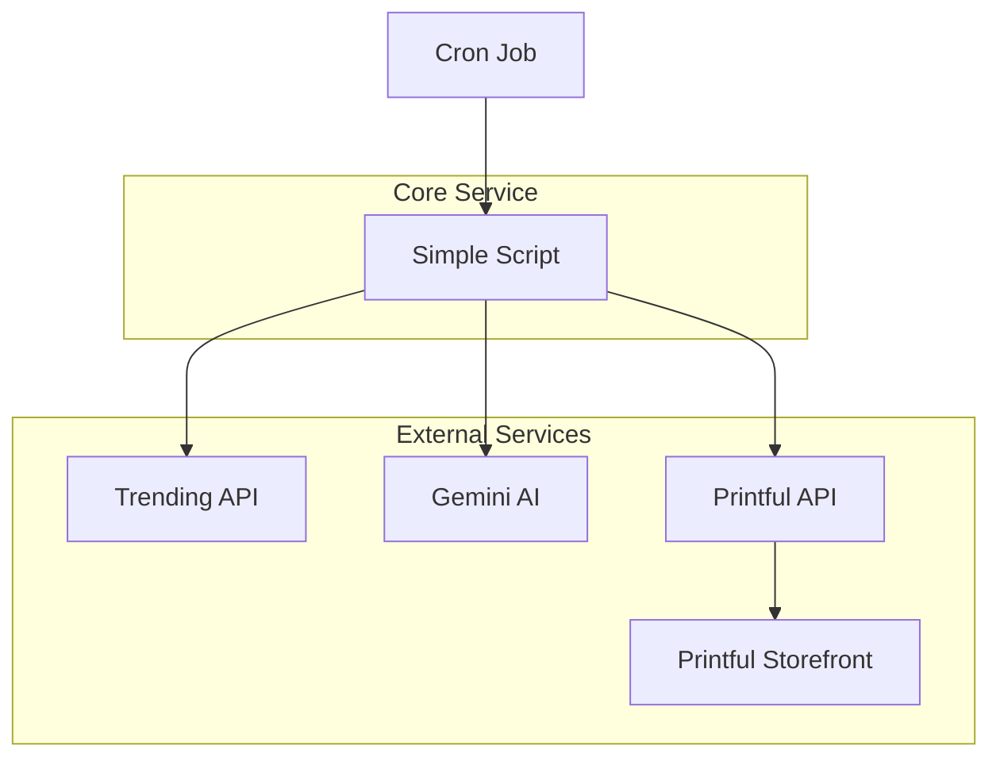

# Simplified AI Generated Clothing Brand - System Architecture

## 1. Overview

This document describes the simplified technical architecture for the AI Generated Clothing Brand service. The system will automatically generate ONE daily trending topic shirt using AI and upload it to a print-on-demand service with maximum simplicity.

## 2. Simplified Architecture Diagram

## 3. Component Description

### 3.1 Cron Job
- Simple daily scheduler (cron)
- Triggers the generation script once per day

### 3.2 Simple Script
- Main service that orchestrates the workflow
- Fetches trending topic
- Generates AI design
- Uploads to print-on-demand service

### 3.3 Trending API
- Simple source of trending topics
- Could be a basic news or social media API

### 3.4 Gemini AI
- Google's AI service for image generation
- Used within free-tier limits

### 3.5 Printful API
- Print-on-demand service API
- Handles product creation and fulfillment
- Provides storefront for sales

### 3.6 Printful Storefront
- Existing e-commerce solution from print-on-demand provider
- No custom website needed

## 4. Simplified Technology Stack

### 4.1 Backend
- Language: Python (single script)
- No web framework needed
- Simple API clients

### 4.2 Infrastructure
- Any cloud provider with cron capability
- Could even run on a Raspberry Pi
- Minimal resource requirements

### 4.3 External Services
- Trending Topics: Simple free API
- AI Image Generation: Google Gemini (free tier)
- Print-on-Demand: Printful API

## 5. Simplified Data Flow

1. Cron job triggers daily
2. Script fetches one trending topic
3. Script generates shirt design with Gemini AI
4. Script uploads design to Printful
5. Printful handles sales and fulfillment

## 6. Minimal Security Considerations

- API keys stored in environment variables
- Simple error logging to file
- No user data to protect

## 7. Minimal Monitoring

- Basic logging to file
- Simple alerting if script fails
- Manual check of daily generation