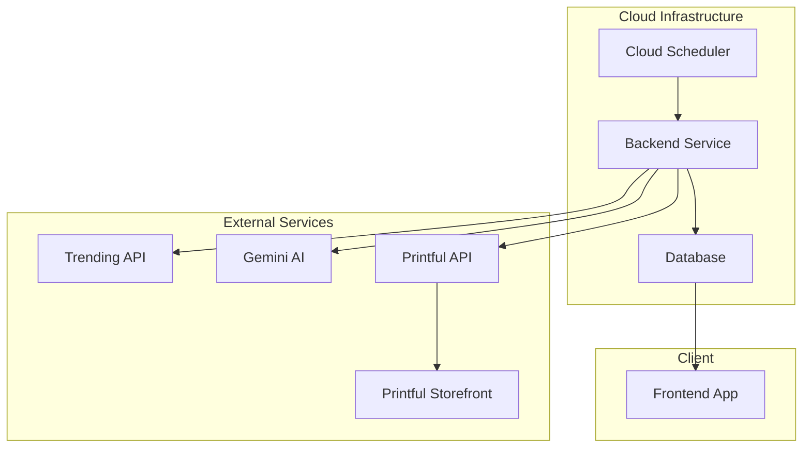

# AI Generated Clothing Brand - Full-Stack Architecture

## 1. Overview

This document describes the full-stack architecture for the AI Generated Clothing Brand application. The system will automatically generate ONE exclusive daily trending topic shirt using AI, store it in a database, publish it to a website, and integrate with print-on-demand suppliers while being deployable to a cheap cloud service for 24/7 operation.

## 2. Architecture Diagram

## 3. Component Description

### 3.1 Cloud Scheduler
- Triggers daily job at specified time
- Implemented using cloud provider's scheduler (Google Cloud Scheduler, AWS EventBridge, etc.)

### 3.2 Backend Service
- Main application logic
- Orchestrates the shirt creation process
- Fetches trending topics
- Generates AI designs
- Stores data in database
- Uploads designs to print-on-demand
- Serves API for frontend

### 3.3 Database
- Stores complete history of generated shirts
- Includes metadata (creation date, topic, design elements)
- Enables fast retrieval for frontend display

### 3.4 Frontend App
- Displays the daily exclusive shirt
- Shows archive of previous designs
- Provides product details
- Links to print-on-demand store for purchases
- Responsive design for all devices

### 3.5 Trending API
- External source of trending topics
- Could be news API, social media API, or similar

### 3.6 Gemini AI
- Google's AI service for image generation
- Used within free-tier limits

### 3.7 Printful API
- Print-on-demand service API
- Handles product creation and fulfillment
- Provides storefront for sales

### 3.8 Printful Storefront
- Existing e-commerce solution from print-on-demand provider
- Handles sales and fulfillment

## 4. Technology Stack

### 4.1 Backend
- Language: Python
- Framework: FastAPI (lightweight, fast)
- Database: PostgreSQL (reliable, free tier available)
- Cloud Platform: Google Cloud Run (cheap, scales to zero)

### 4.2 Frontend
- Framework: React.js (modern, component-based)
- Deployment: Vercel (free tier, excellent React support)
- Styling: Tailwind CSS (utility-first, fast development)

### 4.3 Infrastructure
- Cloud Scheduler: Google Cloud Scheduler (free tier)
- Containerization: Docker
- CI/CD: GitHub Actions (free)
- Monitoring: Basic logging and error tracking

### 4.4 External Services
- Trending Topics: NewsAPI or similar
- AI Image Generation: Google Gemini
- Print-on-Demand: Printful API
- Database: Supabase (PostgreSQL with free tier)

## 5. Data Flow

1. Cloud scheduler triggers daily job
2. Backend service fetches trending topic
3. Backend service generates shirt design with Gemini AI
4. Backend service stores design metadata in database
5. Backend service uploads design to Printful
6. Frontend app retrieves data from database via backend API
7. Users view shirts on website and purchase via Printful storefront

## 6. Deployment Strategy

### 6.1 Backend Deployment
- Containerized with Docker
- Deployed to Google Cloud Run
- Scales to zero when not in use (cost-effective)
- Triggered daily by Cloud Scheduler

### 6.2 Frontend Deployment
- Deployed to Vercel
- Automatic builds from GitHub
- Global CDN for fast delivery
- Free tier sufficient for initial traffic

### 6.3 Database
- Supabase PostgreSQL (free tier)
- Automatic backups
- Easy scaling when needed

## 7. Security Considerations

- API keys stored in cloud provider's secret management
- Database connections secured with SSL
- Rate limiting for external API calls
- Input validation for all external data

## 8. Scalability Considerations

- Cloud Run scales automatically
- Database can be upgraded as needed
- CDN for image delivery
- Caching for frequently accessed data

## 9. Monitoring and Logging

- Application logs for debugging
- Basic error tracking
- Uptime monitoring
- Performance metrics

## 10. Cost Optimization

- Google Cloud Run free tier (2 million requests/month)
- Vercel free tier (plenty for initial traffic)
- Supabase free tier (10k rows)
- Printful (pay-per-sale model)
- Only pay for what's used

## 11. Future Enhancements

- User notification system
- Social media sharing features
- Analytics dashboard
- Mobile application